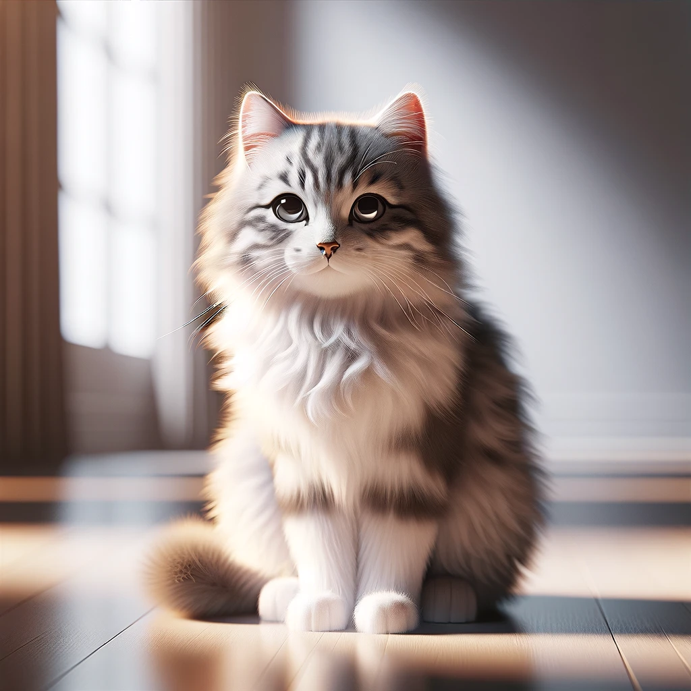

# Create Multiple Images with a Single Prompt

ChatGPT is good at creating imaages using DALL-E, but it only creates 1 or 2 at a time.
This simple trick will let you create a batch of images with a single prompt

## Prompt
Let's create 10 images of cats
```
Loop 10 times
- Create an image of a cat and save it to a file
```

## Response
I'm not going to include all 10 images here, but you should get the idea.


```
The first cat image has been successfully generated and saved.

...

The ninth cat image has been generated and saved,

Proceeding with the creation of the final, tenth image.

The tenth and final cat image has been generated and saved, 

All ten images have now been successfully created and stored. If there's anything more you'd like to do with these images or any other assistance you need, please let me know!
```
---

# List Files
## Prompt
verify that the files have been saved

```
List all the files
```
## Response

```
Here are the files that have been generated and saved:

1. An_image_of_a_majestic_Siamese_cat_sitting_with_an.png
2. A_realistic_image_of_a_domestic_cat_sitting_calmly.png
3. A_serene_image_of_a_long-haired_white_cat_lying_gr.png
4. An_image_of_a_playful_kitten_with_striking_blue_ey.png
5. A_whimsical_image_of_a_kitten_chasing_a_fluttering.png
6. A_captivating_image_of_a_Bengal_cat,_its_coat_a_vi.png
7. A_detailed_image_of_a_cat_lounging_in_sunlight,_sh.png
8. A_heartwarming_scene_of_a_mother_cat_with_her_litt.png
9. An_enchanting_image_of_a_fluffy_Persian_cat,_with_.png
10. A_serene_portrait_of_a_grey_tabby_cat_sitting_atop.png

Each file corresponds to one of the cat images created. If you need further assistance with these files or have any other requests, feel free to let me know.
```
---

# Utilizing ChatGPT for Image Generation

This case study explores the innovative use of ChatGPT in conjunction with DALL·E, OpenAI's state-of-the-art image generation model, to automate the creation of a series of images. The task involved generating ten distinct images of cats, each described with specific characteristics to ensure a variety of styles and settings. This exercise demonstrates the synergy between natural language processing (NLP) and image generation technologies, offering insights into their potential for streamlining content creation in digital media.

## Objective

The primary objective was to leverage ChatGPT's capability to interpret and execute commands related to image generation using DALL·E. This involved creating ten unique images of cats based on detailed descriptions, showcasing the versatility and precision of AI-driven creative processes.

## Methodology

1. **Command Interpretation**: The session began with ChatGPT interpreting the user's request to generate ten images of cats, each with its distinct characteristics. This required a clear understanding of the task and the ability to translate descriptions into detailed prompts for DALL·E.

2. **Image Generation with DALL·E**: For each image, ChatGPT crafted a unique prompt that encapsulated the user's specifications, ranging from the cat's fur colour and texture to its environment and activities. These prompts were then processed by DALL·E to create images that matched the descriptions as closely as possible.

3. **Iteration and Storage**: The process was iteratively executed ten times, with each cycle involving the generation of an image followed by its storage. This demonstrated the model's ability to handle repetitive tasks efficiently while maintaining a high standard of creativity and adherence to the given descriptions.

4. **File Management**: Upon the completion of each image generation, the files were automatically saved with descriptive names, facilitating easy identification and retrieval. This aspect of the task highlighted the integration of file management operations within the AI-driven workflow.

## Results

The exercise resulted in the successful generation and storage of ten high-quality images, each reflecting the specified attributes and settings. The images showcased a wide range of artistic renditions of cats, from playful kittens to serene portraits, demonstrating the model's versatility and the richness of its creative capabilities.

## Discussion

This case study illustrates the potential of combining NLP and image generation technologies to automate and enhance creative processes. The ability of ChatGPT to interpret complex commands and utilise DALL·E for image generation opens up new avenues for content creation across various domains, including digital media, advertising, and educational resources.

Furthermore, the workflow exemplifies how AI can support repetitive and detailed-oriented tasks, reducing the time and effort required by humans. It also highlights the importance of precise language and clear specifications in achieving desired outcomes when interacting with AI models.

## Conclusion

The integration of ChatGPT and DALL·E for automated image generation represents a significant advancement in the field of AI. This case study not only showcases the practical application of these technologies but also highlights their potential to revolutionize content creation. As AI continues to evolve, the synergy between language processing and image generation models will undoubtedly offer even more innovative solutions to creative challenges.