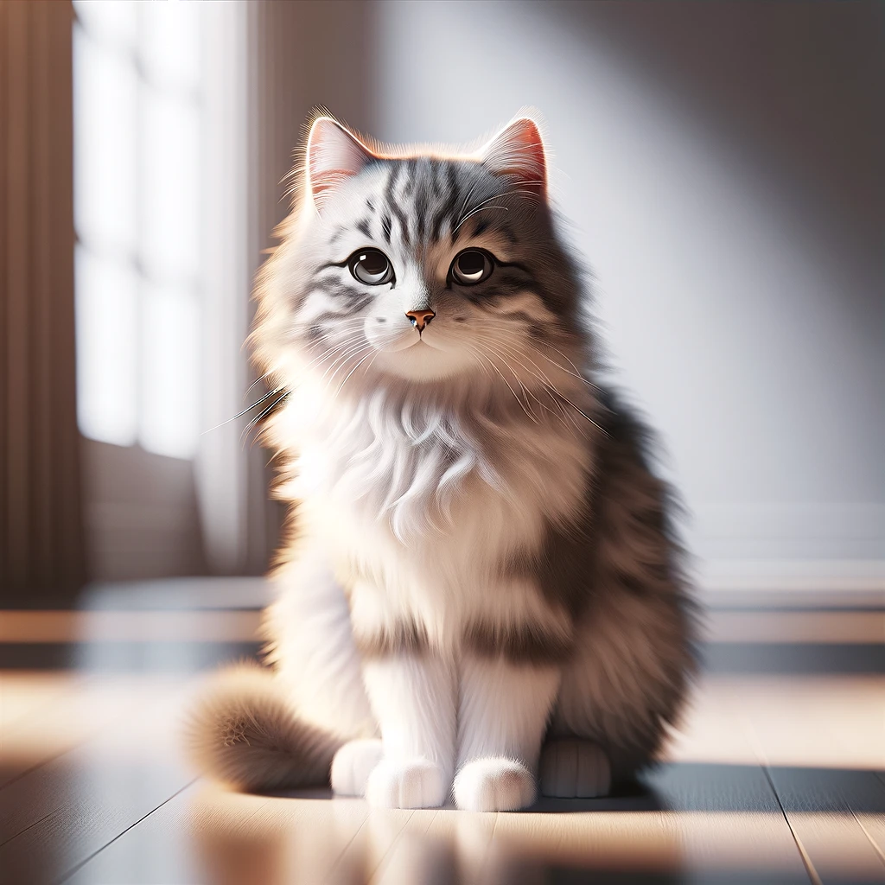

# Create Many Images with a Single Prompt

ChatGPT is good at creating imaages using DALL-E, but it only creates 1 or 2 at a time.
This simple trick will let you create a batch of images with a single prompt

## Prompt
Let's create 10 images of cats
```
Loop 10 times
- Create an image of a cat and save it to a file
```

## Response
I'm not going to include all 10 images here, but you should get the idea.


```
The first cat image has been successfully generated and saved.

...

The ninth cat image has been generated and saved,

Proceeding with the creation of the final, tenth image.

The tenth and final cat image has been generated and saved, 

All ten images have now been successfully created and stored. If there's anything more you'd like to do with these images or any other assistance you need, please let me know!
```

## Prompt
verify that the files have been saved

```
List all the files
```
## Response

```
Here are the files that have been generated and saved:

1. An_image_of_a_majestic_Siamese_cat_sitting_with_an.png
2. A_realistic_image_of_a_domestic_cat_sitting_calmly.png
3. A_serene_image_of_a_long-haired_white_cat_lying_gr.png
4. An_image_of_a_playful_kitten_with_striking_blue_ey.png
5. A_whimsical_image_of_a_kitten_chasing_a_fluttering.png
6. A_captivating_image_of_a_Bengal_cat,_its_coat_a_vi.png
7. A_detailed_image_of_a_cat_lounging_in_sunlight,_sh.png
8. A_heartwarming_scene_of_a_mother_cat_with_her_litt.png
9. An_enchanting_image_of_a_fluffy_Persian_cat,_with_.png
10. A_serene_portrait_of_a_grey_tabby_cat_sitting_atop.png

Each file corresponds to one of the cat images created. If you need further assistance with these files or have any other requests, feel free to let me know.
```
